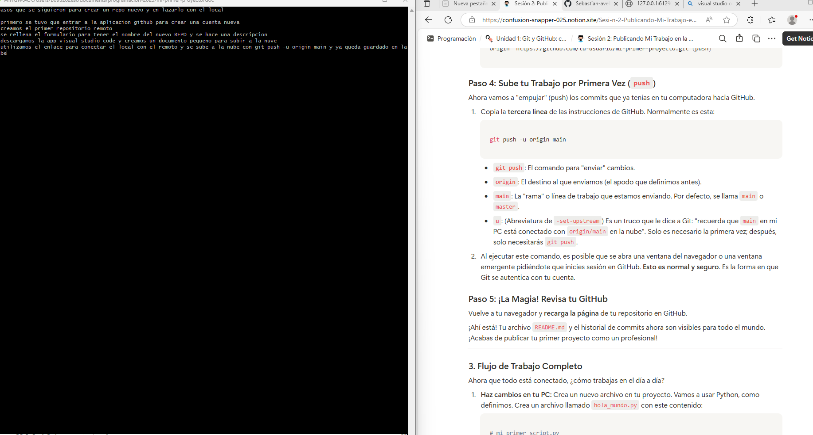

# pasos para la creacion del repoy enlazador local
1. entrar a github y crear la cuenta
2. rellenar el formulario y crearlo y publicarlo en github
3. conectar el local con el remoto pegando el link 
4. subir el trabajo y finalizar por primera vez

